# Books-Management-System
C语言期末大作业——图书信息管理系统（C语言，单链表）

1.题目内容
==========

1.1.系统名称
--------

六、图书信息管理程序

1.2.基本要求
--------

1.  使用链表保存图书信息，每个节点要求包含图书的编号、书名、作者、购买日期和价格信息；

2.  可以对当前图书数据库进行增加、删除操作，并实现按图书编号进行查询；

3.  系统完成后应实现类似下图所示界面；

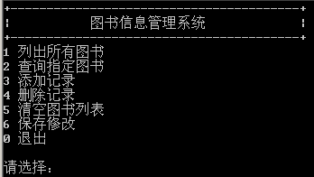

2.完成内容
==========

2.1.基本任务
------------

1.  使用链表保存图书信息：

    1.  图书编号；

    2.  图书名；

    3.  图书作者；

    4.  图书库存数量；

    5.  图书价格；

2.  可对链表进行CRUD操作：

3.  有Shell界面

2.2.拓展任务
------------

1.  使用Git管理代码；

2.  推送到GitHub上开源：

>   <https://github.com/yuebanquan/Books-Management-System>

1.  将代码分模块开发；

2.  查询功能扩展根据书名和作者查询

3.  有一定的异常管理机制；

3.设计内容
==========

3.1.代码结构设计
----------------

3.2.系统模块设计
----------------

3.3．数据结构设计
-----------------

### 3.3.1.链表：

结构体标志：Node

结构体声明变量：Book

结构体成员列表：

| 数据名     | 数据类型 | 备注       |
| ---------- | -------- | ---------- |
| id         | int      | 图书编号   |
| name       | char     | 图书名     |
| author[20] | char     | 图书作者   |
| inventory  | int      | 图书库存量 |
| price      | float    | 价格       |
| next       | Node\*   | 指针域     |

结构体代码：

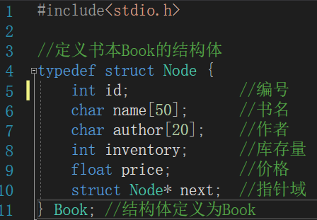

3.4．算法设计
-------------

### 3.4.1.冒泡排序法：

1.  时间复杂度：$$O\left( n^{2} \right)$$；

2.  算法原理：

    1.  比较相邻的元素。如果第一个比第二个大，就交换他们两个；

    2.  对每一对相邻元素做同样的工作，从开始第一对到结尾的最后一对。在这一点，最后的元素应该会是最大的数；

    3.  针对所有的元素重复以上的步骤，除了最后一个；

    4.  持续每次对越来越少的元素重复上面的步骤，直到没有任何一对数字需要比较。

### 3.4.2.顺序查找法：

1.  时间复杂度：$$O\left( n \right)$$；

2.  算法原理：对于任意一个序列以及一个给定的元素，将给定元素与序列中元素依次比较，直到找出与给定关键字相同的元素，或者将序列中的元素与其都比较完为止。

4.程序结果
==========

4.1.编译后程序
--------------

4.2.主界面
----------

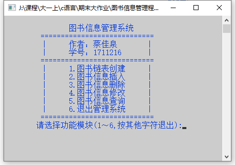

4.3.图书信息查询界面
--------------------

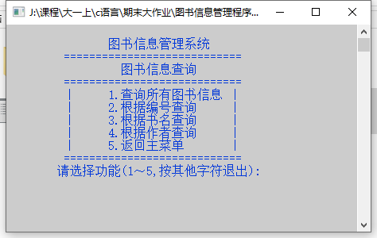

4.4.图书链表创建
----------------

### 4.4.1.链表未创建：

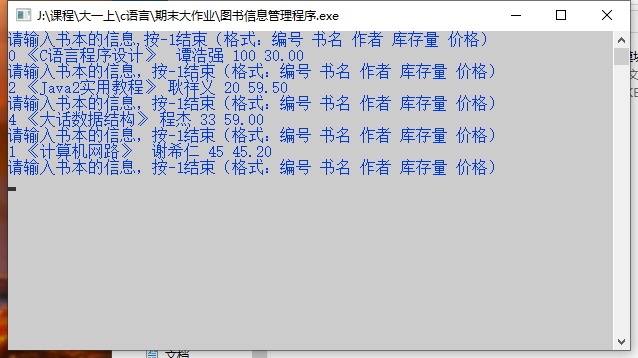

### 4.4.2.链表已创建

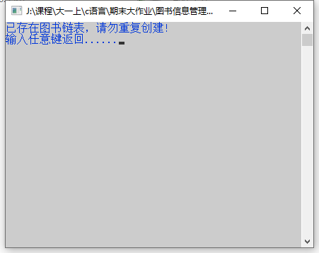

4.5.图书信息插入
----------------

### 4.5.1.链表未创建

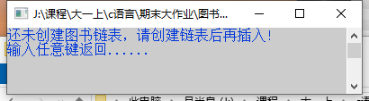

### 4.5.2.插入成功

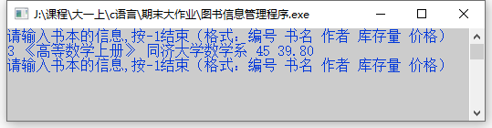

4.6.查询所有图书信息
--------------------

### 4.6.1.链表未创建

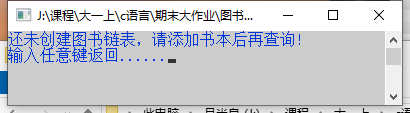

### 4.6.2.查询成功

4.7.根据编号查询
----------------

### 4.7.1.链表未创建

### 4.7.2.查询成功

### 4.7.3.查询失败

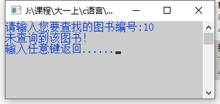

4.8.根据书名查询
----------------

### 4.8.1.链表未创建

### 4.8.2.查询成功

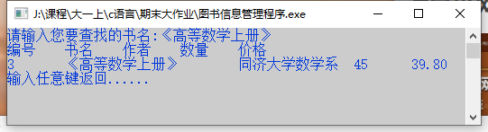

### 4.8.3.查询失败

4.9.根据作者查询
----------------

### 4.9.1.链表未创建

### 4.9.2.查询成功

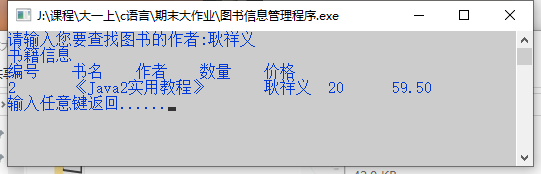

### 4.9.3.查询失败

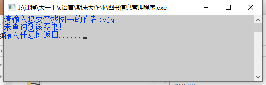

4.10.图书信息删除
-----------------

### 4.10.1.链表未创建

### 4.10.2.删除成功

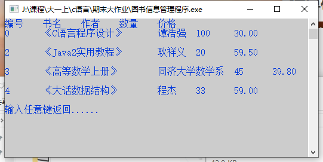

4.11.图书信息修改
-----------------

### 4.11.1.链表未创建

### 4.11.2.修改成功

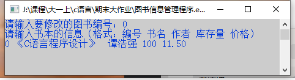

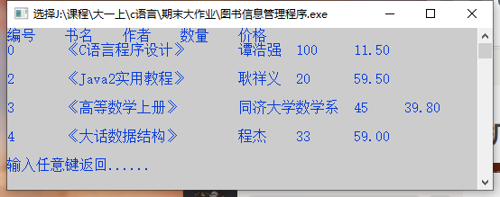

### 4.11.3.未查询到编号

